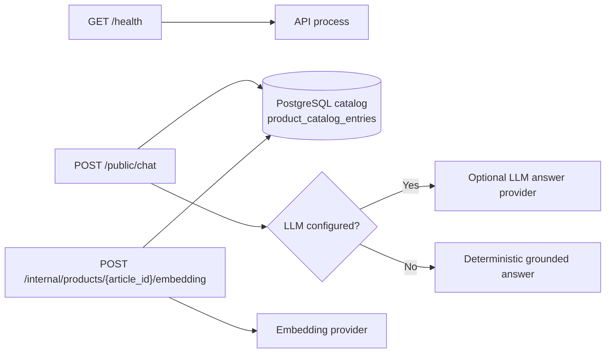
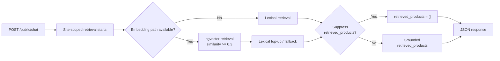

# API Architecture Overview

## Deployable Summary

`apps/api` is the current API deployable. It owns the Python runtime, HTTP entrypoint, local tests, and API-local architecture and spec documents.

## Stack

| Area | Current choice |
| --- | --- |
| Web framework | FastAPI |
| Language | Python 3.14 |
| PostgreSQL retrieval and setup tooling | SQLAlchemy, Alembic, psycopg, pgvector |
| Dependency and command runner | `uv` |
| Test runner | `pytest` |

## Runtime Shape

- `main.py` exposes `build_app()` and the runtime starts through `uvicorn main:build_app --factory`.
- The current route surface exposes service metadata, a root operational health endpoint, the public grounded chat route, and the internal embedding maintenance route.
- Canonical runtime code lives under `src/features/` and `src/core/`.

## Package Boundaries

| Path | Role |
| --- | --- |
| `main.py` | FastAPI bootstrap, `.env` loading, configuration validation, and route registration. |
| `src/core/service` | Shared text normalization used by chat retrieval/runtime and catalog feed preparation. |
| `src/features/chat` | Chat vertical slice containing the chat-specific application, domain, and infrastructure code. |
| `src/features/product` | Product vertical slice containing the internal embedding application flow and adapters. |
| `src/features/chat/application` | Chat orchestration, answer generation, ports, and answer context. |
| `src/features/chat/domain` | Chat-owned models (`Chat`, `Query`, `Product`, `SiteId`), plus guardrail/query-normalization rules. |
| `src/features/chat/infrastructure` | Chat HTTP input plus retrieval orchestration, LLM, and adapter-specific concerns split by HTTP vs persistence. |
| `src/features/chat/infrastructure/input/http` | Chat HTTP adapter package for `/public/chat`, with the route and mapper at the package root plus request/response DTOs under `model/`. |
| `src/features/product/application` | Product embedding use case and capability-local ports. |
| `src/features/product/infrastructure` | Product embedding HTTP input plus provider/store output adapters split by HTTP vs persistence concerns. |
| `src/features/product/infrastructure/input/http` | Product embedding HTTP adapter package with the route at the package root plus response/status DTOs under `model/`. |
| `tests` | API-local regression coverage. |

## Model and DTO Conventions

- `src/core/service/` contains only genuinely shared domain services used across more than one slice/runtime boundary.
- Chat-owned catalog models stay under `src/features/chat/domain/model/` even when reused across chat application and infrastructure modules.
- `src/features/chat/infrastructure/input/http/model/` contains the Pydantic DTOs used by the chat route and mapper.
- `src/features/chat/infrastructure/output/http/` contains provider-facing HTTP clients and their errors, while `output/persistence/` contains PostgreSQL-backed retrieval code.
- `src/features/product/infrastructure/input/http/model/` contains the embedding route response/status DTOs.
- `src/features/product/infrastructure/output/http/` contains provider-facing embedding client code and errors, while `output/persistence/` contains the catalog repository, catalog reader, and embedding store.
- HTTP DTO names follow the transport-layer convention:
  - `...Request` for direct HTTP request body models.
  - `...Response` for direct HTTP endpoint response models.
  - `...DTO` for intermediate or nested reusable transport models.
- Domain models and HTTP DTOs are separate types even when names overlap. Route code may alias imports when a domain type such as `ChatRequest` coexists with an HTTP `ChatRequest`.

## Current Route Surface

| Route | Status | Purpose |
| --- | --- | --- |
| `GET /` | Implemented | Returns service status metadata. |
| `GET /health` | Implemented | Returns process/liveness status only as the operational root health endpoint. |
| `POST /public/chat` | Implemented | Validates `site_id` and `query`, retrieves grounded catalog evidence from PostgreSQL, and returns a grounded JSON response or retrieval-unavailable failure. |
| `POST /internal/products/{article_id}/embedding` | Implemented | Internal maintenance route protected at the `/internal` router level, returning `already_embedded` without provider config when an embedding exists and `force=false`, and otherwise creating or refreshing one stored product embedding with lazy provider config. |

## Endpoint and Resource View

- `GET /health` is process-only and does not depend on PostgreSQL or external providers.
- `POST /public/chat` always depends on the PostgreSQL catalog and uses the LLM path only when runtime config enables it.
- `POST /internal/products/{article_id}/embedding` depends on the PostgreSQL catalog plus the embedding provider when it needs to create or refresh an embedding.

## Request Flow

`HTTP request -> FastAPI route -> chat mapper -> chat use case -> opportunistic pgvector retrieval (similarity >= 0.3) with lexical top-up/fallback -> response context -> optional LLM or deterministic answer generation -> chat mapper -> HTTP JSON response`

- `ChatUseCase` always retrieves catalog products first.
- Retrieved products are packaged into `ResponseContext` before answer generation.
- `LlmAnswerGenerator` is enabled only when `LLM_BASE_URL` and `LLM_API_KEY` are both non-blank after environment and `.env` loading.
- `LLM_TIMEOUT_SECONDS` optionally overrides provider timeout; otherwise the runtime uses the built-in default.
- If `LLM_BASE_URL` or `LLM_API_KEY` is missing or blank, the use case stays in deterministic catalog-grounded mode.
- If `LLM_BASE_URL` is present but invalid, startup fails fast even when `LLM_API_KEY` is missing.
- If the provider request fails, the use case returns the deterministic catalog-grounded answer instead.
- Provider HTTP error diagnostics are sanitized before logging so secrets are not echoed back.
- Manual local LLM e2e coverage exists via `make test-e2e`, but the default runtime and default test flow do not require LLM credentials.
- The repository keeps local Docker Compose PostgreSQL + pgvector infrastructure under `infrastructure/local/docker-compose.yml`.
- Manual persistence commands live under `apps/api` via Alembic and `python scripts/product_catalog_feed.py`; both commands load `apps/api/.env`, use the sync SQLAlchemy PostgreSQL URL form (`postgresql+psycopg://...`), and the feed preserves existing embeddings on rerun.
- `build_app()` requires `PRODUCT_CATALOG_DATABASE_URL`, wires `/public/chat` to a chat-owned retriever that delegates catalog SQL and readiness checks to the product-owned catalog reader, and preserves opportunistic pgvector retrieval with a `0.3` similarity threshold plus lexical top-up/fallback.
- Public product-facing endpoints live under `/public/*`, while `GET /health` stays outside that namespace as the operational root health probe.
- `/internal/*` always requires `INTERNAL_API_TOKEN`; missing token config makes internal routes unavailable with `503`, missing request headers return `401`, and wrong header values return `403`.
- Lazy embedding provider config is only required when `POST /internal/products/{article_id}/embedding` generates or recalculates an embedding, while existing embeddings can still return `already_embedded` when `force=false`.
- `build_app()` does not run Alembic or catalog feed commands at startup, the JSON dataset is feed-only, and `/public/chat` uses opportunistic pgvector retrieval with a 0.3 similarity threshold plus lexical top-up/fallback.

## External API Dependencies

The static product dataset JSON is a feed input for `scripts/product_catalog_feed.py`. It is not a runtime dependency of `GET /health` or `POST /public/chat`.

### `/public/chat` Retrieval Flow

## Deployable Boundary

- This document describes only `apps/api`.
- API-specific framework, testing, and package-structure choices do not define repository-wide architecture.
- This document does not define architecture outside `apps/api`.

## Documentation Pointers

- Use `../../../../README.md` for repository-level orientation.
- Use `../specs/assistant-api-runtime.md` for the current HTTP contract.
- Use `../specs/dataset-grounded-retrieval.md` for the current retrieval boundary.
